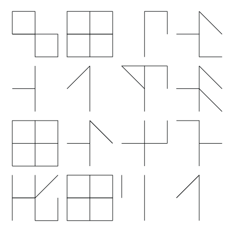

# cristgraphia

...an old index full of mystery that the cistercian monks used to make 
an inventory of their library serves as a pretext for an encryption game. 
Many ideas are behind it, such as the way the Easter Island natives used to write... snail-shaped.

This project is a port of a previous [`ruby` version]()

## Installation

TODO: Write installation instructions here

## Usage

So you want to Cipher your message with some techniques to a number sequence
and then use the cistercian numbers and a nice snail placement.

## Development

TODO: Write development instructions here

## Contributing

1. Fork it (<https://github.com/chussenot/cristgraphia/fork>)
2. Create your feature branch (`git checkout -b my-new-feature`)
3. Commit your changes (`git commit -am 'Add some feature'`)
4. Push to the branch (`git push origin my-new-feature`)
5. Create a new Pull Request

## Contributors

- [Clement Hussenot](https://github.com/chussenot) - creator and maintainer

## References about this old index

- [cistercian numbers](https://glossographia.wordpress.com/2013/07/09/cistercian-number-magic-of-the-boy-scouts/)
- [the ciphers of the monks](https://en.wikipedia.org/wiki/The_Ciphers_of_the_Monks)
- [king ciphers](http://akira.ruc.dk/~jensh/Publications/2002%7bR%7d21_King_Ciphers.PDF)
- [cistercian-numerals-ciphers-of-monks](http://luxoccultapress.blogspot.fr/2013/01/cistercian-numerals-ciphers-of-monks.html)
- [create a stacked cipher](https://www.wikihow.com/Create-a-Stacked-Cipher)